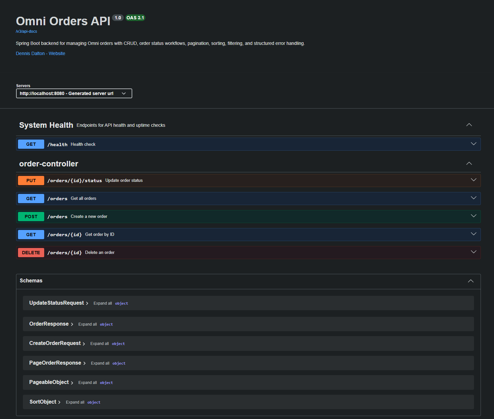
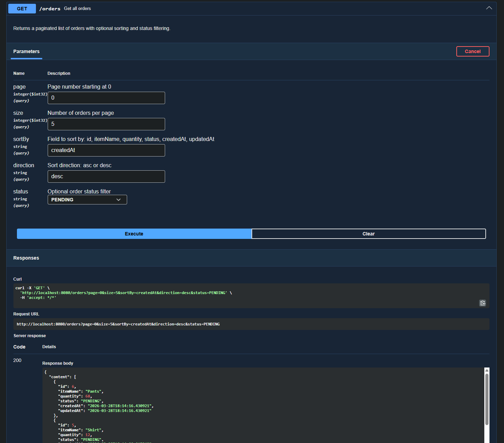

# Omni Orders API

Spring Boot backend project for managing omni-channel orders with full CRUD functionality, validation, and persistent storage.

---

## Overview

This project demonstrates backend development using Spring Boot by implementing a realistic order management system. It focuses on RESTful API design, clean structure, and handling core backend responsibilities.

---

## Features

- Create, read, update, and delete orders (CRUD)
- Persistent H2 database
- Input validation
- Global exception handling
- Pagination and sorting
- Filtering support
- OpenAPI / Swagger configuration
- Health check endpoint

---

## Tech Stack

- Java
- Spring Boot
- Spring Data JPA
- H2 Database
- Maven

---

## Running the Project

1. Clone the repository
2. Open in IntelliJ or your preferred IDE
3. Run the Spring Boot application
4. Access locally: http://localhost:8080

---

## Quick Start

Run the application and test quickly:

GET http://localhost:8080/health

POST http://localhost:8080/orders

Body:
{
  "itemName": "Test Item",
  "quantity": 1
}

GET http://localhost:8080/orders

---

## API Documentation

Swagger UI is available at:

http://localhost:8080/swagger-ui.html

---

## Base URL

http://localhost:8080

---

## Example Endpoints

- GET /orders
- GET /orders/{id}
- POST /orders
- PUT /orders/{id}/status
- DELETE /orders/{id}
- GET /health

---


## Query Examples

### Basic Retrieval
```md
- All orders: `GET /orders`
- Order by ID: `GET /orders/1`
- Health check: `GET /health`
```
### Pagination
```md
- First page, 5 results: `GET /orders?page=0&size=5`
- Second page, 5 results: `GET /orders?page=1&size=5`
```

### Sorting
```md
- Newest first: `GET /orders?sortBy=createdAt&direction=desc`
- Item name ascending: `GET /orders?sortBy=itemName&direction=asc`
- Quantity descending: `GET /orders?sortBy=quantity&direction=desc`
- Updated date ascending: `GET /orders?sortBy=updatedAt&direction=asc`
```

### Filtering by Status
```md
- Pending: `GET /orders?status=PENDING`
- Processing: `GET /orders?status=PROCESSING`
- Ready for pickup: `GET /orders?status=READY_FOR_PICKUP`
- Completed: `GET /orders?status=COMPLETED`
- Cancelled: `GET /orders?status=CANCELLED`
```

### Combined Examples
```md
- Pagination + sorting: `GET /orders?page=0&size=10&sortBy=updatedAt&direction=desc`
- Pagination + filtering: `GET /orders?page=0&size=5&status=PROCESSING`
- Sorting + filtering: `GET /orders?status=READY_FOR_PICKUP&sortBy=createdAt&direction=asc`
- Full example: `GET /orders?page=1&size=5&sortBy=quantity&direction=desc&status=PENDING`
```

---

## Example Request Bodies

Create Order

```json
{
  "itemName": "Nike Shoes",
  "quantity": 2
}
```

Update Order Status

```json
{
  "status": "PROCESSING"
}
```

Allowed values:
- PENDING
- PROCESSING
- READY_FOR_PICKUP
- COMPLETED
- CANCELLED

---

## Example Response

### Get Order By ID

`GET /orders/1`

Response:

```json
{
  "id": 1,
  "itemName": "Nike Shoes",
  "quantity": 2,
  "status": "PROCESSING",
  "createdAt": "2026-03-28T18:45:00",
  "updatedAt": "2026-03-28T19:00:00"
}
```
---

### Paginated Orders

`GET /orders?page=0&size=5`

Response:

```json
{
  "content": [
    {
      "id": 6,
      "itemName": "Pants",
      "quantity": 68,
      "status": "PENDING",
      "createdAt": "2026-03-28T18:14:16.430921",
      "updatedAt": "2026-03-28T18:14:16.430921"
    },
    {
      "id": 5,
      "itemName": "Shirt",
      "quantity": 12,
      "status": "PENDING",
      "createdAt": "2026-03-28T18:14:00.017942",
      "updatedAt": "2026-03-28T18:14:00.017942"
    }
  ],
  "pageable": {
    "pageNumber": 0,
    "pageSize": 5
  },
  "totalElements": 6,
  "totalPages": 2
}
```

---

---

## Screenshots

### Swagger UI Overview

<p align="center">
  
</p>

<p align="center"><em>Overview of available API endpoints</em></p>

---

### Example Request & Response

<p align="center">
  
</p>

<p align="center"><em>Example request demonstrating pagination, sorting, and filtering</em></p>

---

## Postman Collection

You can import and test all endpoints using the included Postman collection:

[Download Collection](other_files/Omni_Orders_Postman.json)

---

## Validation Rules

Create Order:
- itemName must not be blank
- quantity must be at least 1

Query Parameters:
- page must be 0 or greater
- size must be at least 1
- size cannot exceed 50
- sortBy must be one of:
  id, itemName, quantity, status, createdAt, updatedAt
- direction must be asc or desc

---

## API Constraints

- Maximum page size is 50
- Only predefined fields can be used for sorting
- Invalid query parameters return structured error responses

---

## Error Handling

- 400 Bad Request
- 404 Not Found
- 409 Conflict

---

## Business Rules

- New orders default to PENDING
- Status updates use a dedicated endpoint
- Completed orders cannot be modified
- Cancelled orders cannot be modified
- Orders cannot be updated to the same status

---

## Architecture

Controller → Service → Repository → Database

---

## Design Decisions

- DTOs used to control API input/output
- Global exception handler for consistent responses
- Restricted sorting fields to prevent invalid queries
- Business logic kept in service layer
- Enum used for order status for type safety

---

## Local Testing

A requests.http file is included for quick API testing inside IntelliJ.

---

## Project Structure

- controller
- service
- repository
- model
- dto
- exceptions
- config

---

## Why I Built This

I built this project to strengthen my backend development skills and demonstrate real-world API design, validation, pagination, sorting, filtering, and structured error handling.

---

## Future Improvements

- Authentication and authorization
- Role-based access control
- Replace H2 with PostgreSQL
- Dockerize the application
- Deploy to cloud hosting

---

## API Testing

All endpoints were tested using Postman.

---

## Author

Dennis Dalton
